<p align="center">
  
</p>

<div align="center">
<details><summary><b>Read this in other languages</b></summary>

🇺🇸 <a href="README.md">English</a> | 🇨🇳 <a href="README.zh-CN.md">简体中文</a>

</details>
</div>

<p align="center">
  <a href="https://piyapi.cloud"></a>
  <a href="docs/HIPAA_ARCHITECTURE.md"></a>
  <a href="docs/SOC2_CONTROLS.md"></a>
  <a href="#-testing"></a>
  <a href="#-testing"></a>
  <a href="docs/API.md"></a>
  <a href="packages/mcp-server/"></a>
  <a href="LICENSE"></a>
  <a href="frontend/src/components/intelligence/MemoryGraph.tsx"></a>
</p>

<p align="center">
  <b>PiyAPI by Negentro: The Visual & Cognitive Memory OS for AI Agents</b>
</p>

> **"Don't just give your AI a database. Give it a mind."**

**PiyAPI** is the first **Neuro-Symbolic, Self-Correcting, and Sovereign Cognitive Memory Operating System** for AI agents. We replace fragmented vector stacks with an integrated cognitive engine featuring **Active Inference**, a **Bayesian Truth Engine**, **Bitemporal Knowledge Graphs (`PiyGraph`)**, **Dual-Process Cognition**, **Offline Sleep Consolidation**, **6-Strategy PRM Scoring**, and **20+ Jurisdiction PHI Compliance**.

- **Active Inference (Friston FEP).** Computes a Variational Surprise Score on memory writes. High-novelty facts trigger graph reconsolidation, while redundant text is compressed.
- **Bayesian Truth Engine.** Beta-Binomial belief distribution updates that non-destructively supersede obsolete facts using `invalid_at` timestamps.
- **Bitemporal PiyGraph.** Two-clock temporal tracking with time-travel queries.

<p align="center">
  
</p>

**Get started** (TypeScript SDK):

```bash
npm install @piyapi/sdk
```

```typescript
import { PiyAPIClient } from '@piyapi/sdk';
const client = new PiyAPIClient({ apiKey: process.env.PIYAPI_API_KEY! });
// ...
```

**Works in** Claude Desktop, Cursor, Antigravity, and Windsurf via MCP.

---

## 🚀 Why PiyAPI?

Traditional vector databases are static black boxes: they store embeddings, but they cannot resolve factual contradictions, understand temporal changes, or protect sensitive healthcare/financial data.

```mermaid
flowchart TB
    subgraph ClientLayer["1. Client & Agent Ecosystem"]
        Agents["AI Agents (Claude, Cursor, AutoGen, CrewAI)"]
        TSSDK["TypeScript SDK (@piyapi/sdk)"]
        PySDK["Python SDK (piyapi-memory)"]
        MCP["Model Context Protocol (40+ Tools)"]
        CDC["12+ Change Data Capture Connectors"]
    end
    subgraph SecurityGateway["2. Gateway & Sovereign Security"]
        GW["API Gateway & Dynamic Rate Limiting"]
        PHI["PHI/PII Firewall (20+ Jurisdictions)"]
        Shredder["Cryptographic Digital Shredder (Key Destruction)"]
        Audit["Immutable Audit Log (HMAC SHA-256 -> S3)"]
    end
    subgraph CognitiveCore["3. Neuro-Symbolic Cognitive Engine"]
        FEP["Active Inference (Friston FEP Surprise Scorer)"]
        TruthEngine["Bayesian Truth Engine (Beta-Binomial Updates)"]
        PiyGraph["PiyGraph: Bitemporal Knowledge Graph"]
        DualLane["Dual-Process Cognition (System 1 & System 2)"]
        Sleep["6-Phase Offline Sleep Consolidation"]
        HybridScorer["HybridScorer PRM Substrate (6 Strategies)"]
    end
    subgraph MemoryHierarchy["4. Four-Tier Memory Substrate"]
        WM["Working Memory (Volatile Buffers)"]
        EM["Episodic Memory (Event Streams)"]
        SM["Semantic Memory (Distilled Graph)"]
        PM["Procedural Memory (Recipes & Gotchas)"]
    end
    subgraph DataStorage["5. Encrypted Persistence"]
        PG[("PostgreSQL 15 + pgvector (AES-256-GCM)")]
        Redis[("Redis 7 L1/L2 Cache + BullMQ")]
    end
    ClientLayer --> SecurityGateway
    SecurityGateway --> CognitiveCore
    CognitiveCore --> MemoryHierarchy
    MemoryHierarchy --> DataStorage
```



---

## What it does

| Capability | What you get |
|---|---|
| **Active Inference Engine** | Eliminates context clutter and token waste by computing Variational Surprise / Novelty Metric on ingestion layer. |
| **Bayesian Truth Engine** | Non-destructive belief updating preventing catastrophic overwrite when facts evolve over time. |
| **Bitemporal Knowledge Graph** | Two-clock chronology & time travel separating `event_time` and `transaction_time`. |
| **Dual-Process Cognition** | Fast System 1 (Sub-15ms caching) vs Slow System 2 (Reasoning reader + speculative prefetch). |
| **6-Phase Sleep Consolidation** | Mimics mammalian REM/NREM sleep cycles with an autonomous offline background daemon. |
| **HybridScorer PRM Substrate** | 6-strategy retrieval engine combining dense vectors, BM25, SPLADE, exponential decay, and graph centrality. |
| **Sovereign Graph Unlearn Engine** | GDPR Article 17 Cryptographic Shredder via Cycle-Safe Graph Cascade and Cryptographic Key Destruction. |
| **CDC Auto-Sync Network** | 12+ native Change Data Capture connectors with delta token tracking (GDrive, Notion, GitHub, Slack, etc.). |
| **Multi-Jurisdiction PHI Firewall** | 38-module zero-trust security perimeter ensuring zero raw PII leaks to downstream LLMs. |

---

## Benchmarks & Verified Engine Metrics (Audit: August 2026)

| Metric | Live Production Value |
|---|---|
| **Production Substrate** | **426,524+ LOC** across **1,239** TypeScript modules |
| **Test Suites** | **9,258** test cases across **673** test files (100% Jest) |
| **Property-Based Tests** | **1,329** `fc.property()` mathematical correctness assertions |
| **HTTP Route Endpoints** | **517** endpoint bindings across 62 route controllers |
| **MCP Tools** | **40 core tools / 52 registrations** in `@piyapi/mcp-server` v2.0.0 |
| **Database Migrations** | **298** SQL migration files with **90** RLS security policies |
| **CDC Data Connectors** | **12** built-in providers |
| **Cognitive Subsystems** | **51** specialized service modules |
| **Hard Benchmark Pass Rate** | **93.8%** (75/80) |
| **Adversarial Security Rate** | **82.6%** (71/86) |

---

## Install & Quick Start

<details>
<summary><b>1. Model Context Protocol (MCP) Server</b></summary>

Add to your `claude_desktop_config.json` or `mcp_config.json`:

```json
{
  "mcpServers": {
    "piyapi": {
      "command": "npx",
      "args": ["-y", "@piyapi/mcp-server"],
      "env": {
        "PIYAPI_API_KEY": "your_piyapi_api_key_here",
        "PIYAPI_BASE_URL": "https://api.piyapi.cloud"
      }
    }
  }
}
```
</details>

<details>
<summary><b>2. TypeScript SDK</b></summary>

```bash
npm install @piyapi/sdk
```

```typescript
import { PiyAPIClient } from '@piyapi/sdk';

const client = new PiyAPIClient({
  apiKey: process.env.PIYAPI_API_KEY!,
  baseUrl: 'https://api.piyapi.cloud',
});

// 1. Ingest factual knowledge with automatic PHI redaction & graph linking
const memory = await client.memory.create({
  content: 'Patient prescribed 500mg Metformin twice daily for Type 2 Diabetes.',
  metadata: { domain: 'medical', patientId: 'pat_demo_001' },
});

// 2. Token-Aware Smart Context Retrieval for LLMs
const context = await client.context.retrieve({
  query: 'What medication is the patient taking?',
  maxTokens: 1500,
});

console.log('Optimized Context for LLM Prompt:', context.text);
```
</details>

<details>
<summary><b>3. Python SDK</b></summary>

```bash
pip install piyapi-memory
```

```python
from piyapi import PiyAPIClient

client = PiyAPIClient(api_key="your_api_key_here")

# 1. Ingest factual knowledge
client.memory.store(
    content="Production database migrated to AWS us-east-1 on August 10, 2026.",
    metadata={"team": "devops", "environment": "production"}
)

# 2. Bitemporal Time-Travel Query
historical_facts = client.graph.time_travel(
    query="Where is the production database hosted?",
    as_of_date="2026-05-01T00:00:00Z"
)
```
</details>

<details>
<summary><b>4. LangChain & LlamaIndex Drop-in Adapters</b></summary>

```python
from langchain.chains import ConversationChain
from langchain_openai import ChatOpenAI
from piyapi_langchain import PiyAPIChatMessageHistory

# Connect agent conversation directly to PiyAPI persistent memory
history = PiyAPIChatMessageHistory(
    session_id="user_session_492",
    api_key="your_api_key"
)

conversation = ConversationChain(
    llm=ChatOpenAI(model="gpt-4o"),
    memory=history
)

response = conversation.predict(input="What was our roadmap decision last Tuesday?")
```
</details>

---

## Categorized MCP Tools Catalog

| Category | Tools | Description |
| :--- | :--- | :--- |
| **Memory Lifecycle** | `store_memory`, `update_memory`, `get_memory`, `delete_memory`, `list_memories`, `batch_create`, `pin_memory` | Complete CRUD and bulk ingestion with auto-embedding and graph extraction. |
| **Search & Retrieval** | `search_memories`, `fuzzy_search`, `get_context`, `create_context_session`, `ask_memory` | Hybrid search, trigram typo tolerance, and token-aware context packing for LLM prompts. |
| **Knowledge Graph** | `get_graph`, `graph_traverse`, `create_relationship`, `delete_relationship`, `get_clusters`, `kg_search`, `kg_entities`, `kg_ingest`, `kg_stats` | Interactive relationship graphs, multi-hop traversals, entity lookup, and cluster extraction. |
| **Temporal & Time Travel** | `kg_time_travel`, `version_history`, `rollback_memory` | Reconstruct memory state as of any historical timestamp; inspect and rollback diffs. |
| **Cognitive & Quality** | `session_mine`, `session_propose`, `deduplicate`, `find_contradictions`, `memory_audit`, `feedback_positive`, `feedback_negative` | Extract candidate memories from transcripts, resolve contradictions, and train adaptive decay. |
| **Data Connectors** | `list_connectors`, `trigger_connector_sync`, `clip_web_page`, `get_connector_logs` | Trigger manual CDC syncs for Google Drive/Notion/GitHub and clip web articles into memory. |
| **Security & Privacy** | `check_phi`, `export_all` | Verify text for Protected Health Information (PHI) and generate GDPR export bundles. |

---

## 🧪 Testing & Verification

```bash
npm test           # Run all 9,258 test cases under Jest
npm run test:props # Run 1,329 property-based tests (fast-check)
npm run test:chaos # Run chaos & resilience test suites
```

---

## Intellectual Property, Security & Publishing Safety Protocol

### Legal & Compliance Disclaimer
> ⚠️ **Compliance Disclaimer:** PiyAPI provides technical controls (e.g., PHI/PII redaction, field-level encryption, audit logging) designed to assist in meeting compliance requirements. Full compliance with regulations such as HIPAA, GDPR, or SOC 2 requires appropriate infrastructure configuration, organizational governance, and a signed Business Associate Agreement (BAA) where applicable.

---

## 🤝 Community & Support

- 🌐 **Platform:** [https://piyapi.cloud](https://piyapi.cloud)
- 🐛 **Issues:** [GitHub Issues](https://github.com/NegentroWorld/Piyapi-by-Negentro/issues)
- 📖 **Documentation:** [DOCUMENTATION_INDEX.md](DOCUMENTATION_INDEX.md)
- 🏢 **Enterprise & BAA:** `care.piyapi@outlook.com`
- 🔒 **Security Disclosures:** `piyapi.cloud@gmail.com`

<p align="center">
<strong>PiyAPI by Negentro — Giving AI Agents a True Persistent Mind.</strong>
</p>
