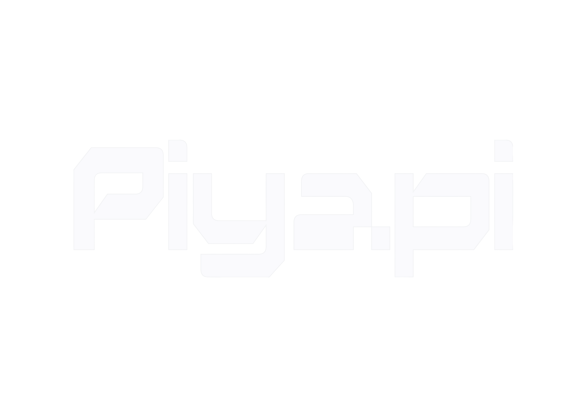

<div align="center">



**Enterprise-grade cognitive memory engine for AI-native applications, intelligent agents, and enterprise workflows.**

[Docs](https://piyapi.cloud/docs) · [Quickstart](https://piyapi.cloud/docs/quickstart) · [Self-host](https://piyapi.cloud/docs/self-hosting) · [Dashboard](https://piyapi.cloud/login) · [Discord](https://discord.gg/negentro)

[](https://www.npmjs.com/package/@piyapi/sdk) [](https://pypi.org/project/piyapi-memory/) [](https://piyapi.cloud/docs) [](https://github.com/negentro/piyapi/blob/main/LICENSE)

</div>

---


PiyAPI is the cognitive memory fabric for AI. Built by [Negentro](https://negentro.com), it provides LLMs with **persistent, long-term bitemporal memory**, multi-signal hybrid search, dynamic context window assembly, knowledge graph reasoning, active inference, and privacy-first data handling — all from a single API.

Your AI forgets everything between conversations. PiyAPI fixes that — with a 329K LOC cognitive engine that goes far beyond simple RAG.

| | |
|---|---|
| 🧠 **Memory Engine** | 8-operator unified surface — store, retrieve, update, delete, merge, summarize, pin, verify. Handles temporal changes, contradictions, and automatic forgetting. |
| 🔍 **Hybrid Search** | Dense vector similarity + BM25 keyword search in a single query. Tunable alpha blending. |
| 🤖 **Cognitive RAG** | Context-aware Q&A with auto-citations. Not just retrieval — reasoning over your memory graph. |
| 🕰️ **Bitemporal Time Travel** | PiyGraph knowledge graph with `valid_at` vs `system_at` reasoning. Query your data as it was at any point in time. |
| 🔌 **12 Data Connectors** | Google Drive · Gmail · Notion · OneDrive · GitHub · Slack · Salesforce · HubSpot · Jira · Confluence · Linear · Web Crawler — auto-sync with real-time CDC webhooks. |
| 📄 **Multi-modal Processing** | PDFs, images (OCR), videos (transcription), code (AST-aware chunking). Upload and it works. |
| 🔐 **Privacy & Compliance** | PHI/PII redaction, tokenization, SAML 2.0 & OIDC SSO, legal hold, data residency, geo-fencing. |
| 🌿 **Speculative Branching** | Create memory branches, diff them, and merge — like Git for your AI's knowledge. |
| 🧩 **30 MCP Tools** | Full Model Context Protocol integration for Cursor, Windsurf, Claude Desktop, and VS Code. |
| 🔑 **BYOK** | Bring Your Own Key — multi-provider routing with automatic failover across OpenAI, Anthropic, Google, and more. |

---

## Use PiyAPI

### 🧑‍💻 I use AI tools

Give your AI assistant persistent memory across every conversation. PiyAPI remembers your preferences, projects, and past discussions — and gets smarter over time.

**[→ Jump to user setup](#give-your-ai-memory)**

### 🔧 I'm building AI products

Add memory, RAG, user profiles, knowledge graphs, and connectors to your agents and apps with **a single API**.

No vector DB config. No embedding pipelines. No chunking strategies.

**[→ Jump to developer quickstart](#build-with-piyapi)**

### 🖥️ I want to run it myself

Enterprise-grade cognitive memory, on your machine. **One binary. Zero config.** Bring any model — or run fully offline.

```bash
curl -fsSL https://piyapi.cloud/install | bash
```

**[→ Jump to self-hosting](#piyapi-local--run-it-yourself)**

---

## Give your AI memory

### MCP Server

PiyAPI ships with a full Model Context Protocol server exposing 30 tools, 3 resources, and 3 prompts.

Server URL:

```text
https://mcp.piyapi.cloud/mcp
```

```json
{
  "mcpServers": {
    "piyapi": {
      "url": "https://mcp.piyapi.cloud/mcp"
    }
  }
}
```

### What your AI gets

| Tool | What it does |
|---|---|
| `memory` | Store, update, merge, or forget information. 8 operators in one unified surface. |
| `recall` | Hybrid search across memories — vector similarity + keyword matching with tunable alpha. |
| `context` | Injects your full profile, preferences, and recent activity into the conversation. |
| `ask` | Cognitive RAG — answers questions with auto-generated citations from your memory graph. |
| `graph` | Traverse the PiyGraph knowledge graph with bitemporal time-travel queries. |

### How it works

1. **You talk to your AI normally.** Share preferences, mention projects, discuss problems.
2. **PiyAPI's cognitive engine extracts and stores the important stuff.** Facts, preferences, project context, temporal relationships — not noise.
3. **Next conversation, your AI already knows you.** It recalls context, resolves contradictions, and forgets expired information automatically.

Memory is scoped with **namespaces** (`X-Namespace-Prefix`) so you can isolate tenants, projects, environments, or anything else.

### Supported clients

**Claude Desktop** · **Cursor** · **Windsurf** · **VS Code** · **Claude Code** · **OpenCode**

---

## Build with PiyAPI

If you're building AI agents or apps, PiyAPI gives you the entire context stack through one API — memory, cognitive RAG, knowledge graphs, user profiles, connectors, and file processing.

### Install

```bash
npm install @piyapi/sdk    # or: pip install piyapi-memory
```

### Quickstart

```typescript
import { PiyAPI } from "@piyapi/sdk";

const client = new PiyAPI({
  apiKey: "sk_live_...",
});

// Store a memory
await client.memories.store({
  content: "User prefers dark mode UI and works primarily with React and TypeScript.",
  tags: ["preferences", "tech-stack"],
  metadata: { source: "onboarding_chat", user_id: "usr_9918" },
});

// Hybrid search — vector + keyword in one call
const results = await client.search({
  query: "What frontend framework does the user prefer?",
  limit: 5,
  alpha: 0.7, // 0 = pure keyword, 1 = pure vector
  include_metadata: true,
});

// Cognitive RAG with citations
const answer = await client.ask({
  query: "Summarize the user's code preferences and UI choices.",
  temperature: 0.2,
});
// answer.response → Natural language answer
// answer.citations → Source memories used
```

```python
from piyapi_memory import PiyAPI

client = PiyAPI(api_key="sk_live_...")

# Store a memory
client.memories.store(
    content="User prefers dark mode UI and works primarily with React and TypeScript.",
    tags=["preferences", "tech-stack"],
    metadata={"source": "onboarding_chat", "user_id": "usr_9918"}
)

# Hybrid search
results = client.search(
    query="frontend framework preference",
    limit=5,
    alpha=0.7
)

# Cognitive RAG
answer = client.ask(query="Summarize user preferences", temperature=0.2)
print(answer.response)
print(answer.citations)
```

### Unified 8-Operator Memory Surface

PiyAPI provides a single endpoint (`/api/v1/memory/op`) supporting 8 operators:

```typescript
// Merge multiple memories into one
await client.memory.op({
  operator: "merge",
  target_memory_ids: ["uuid-1", "uuid-2"],
  new_content: "Merged incident summary...",
  tags: ["ops", "merged_incident"],
});

// Pin critical memories
await client.memory.op({ operator: "pin", target_memory_ids: ["uuid-3"] });

// Verify memory accuracy
await client.memory.op({ operator: "verify", target_memory_ids: ["uuid-4"] });
```

| Operator | Purpose |
|---|---|
| `store` | Create a new memory with content, tags, and metadata |
| `retrieve` | Fetch a memory by ID |
| `update` | Modify existing memory content or metadata |
| `delete` | Remove a memory |
| `merge` | Combine multiple memories into one, archiving originals |
| `summarize` | Generate a summary across selected memories |
| `pin` | Mark memories as critical/permanent |
| `verify` | Validate memory accuracy and freshness |

### Bitemporal Knowledge Graph (PiyGraph)

Query your data as it was at any point in time:

```typescript
// Time-travel query
const snapshot = await client.graph.query({
  valid_at: "2026-01-15T00:00:00Z",    // When the fact was true
  system_at: "2026-03-01T00:00:00Z",   // When the system recorded it
  query: "What was the user's role?",
});
```

### Speculative Memory Branching

```typescript
// Create a branch
const branch = await client.branches.create({
  name: "experiment-a",
  base: "main",
});

// Add memories to the branch
await client.memories.store({
  content: "Experimental preference data",
  branch: "experiment-a",
});

// Diff branches
const diff = await client.branches.diff("main", "experiment-a");

// Merge when satisfied
await client.branches.merge("experiment-a", "main");
```

### Data Connectors

Auto-sync external data into your knowledge base with real-time CDC webhooks:

**Google Drive** · **Gmail** · **Notion** · **OneDrive** · **GitHub** · **Slack** · **Salesforce** · **HubSpot** · **Jira** · **Confluence** · **Linear** · **Web Crawler**

### API at a glance

| Method | Purpose |
|---|---|
| `POST /api/v1/memories` | Store content — text, conversations, documents |
| `POST /api/v1/memories/batch` | Bulk store multiple memories |
| `POST /api/v1/memory/op` | Unified 8-operator surface |
| `POST /api/v1/search` | Hybrid vector + keyword search |
| `POST /api/v1/ask` | Cognitive RAG with citations |
| `GET /api/v1/context` | Context retrieval & summarization |
| `POST /api/v1/kg/*` | PiyGraph knowledge graph queries |
| `POST /api/v1/branches` | Speculative memory branching |
| `POST /api/v1/connectors` | Data connector management |
| `POST /api/v1/documents` | Document processing & upload |
| `POST /api/v1/feedback` | Adaptive learning feedback |

Full API reference → [piyapi.cloud/docs](https://piyapi.cloud/docs)

OpenAPI Spec → [api.piyapi.cloud/docs/raw/openapi.json](https://api.piyapi.cloud/docs/raw/openapi.json)

---

## PiyAPI local — run it yourself

Enterprise-grade cognitive memory, on your machine. One binary. Zero config.

```bash
curl -fsSL https://piyapi.cloud/install | bash
```

```bash
piyapi-server
```

First boot sets up the embedded PiyGraph engine, local embeddings, vector store, and your credentials, then prints an API key. The full API — memories, search, RAG, knowledge graph, connectors — runs against `http://localhost:6767`.

```typescript
const client = new PiyAPI({
  apiKey: "sk_live_...",
  baseURL: "http://localhost:6767", // that's the only change
});
```

- **Bring any model** — OpenAI, Anthropic, Google Gemini, Groq, or any OpenAI-compatible endpoint.
- **BYOK multi-provider routing** — automatic failover across providers.
- **Fully offline** — point it at Ollama and nothing leaves your machine.
- **Your data, one directory** — everything lives in `./.piyapi`, easy to back up or move.
- **Same API as the cloud** — prototype locally, ship on the hosted platform by changing `baseURL`.

---

## Enterprise Features

PiyAPI is built for enterprise from day one:

| Feature | Description |
|---|---|
| **SAML 2.0 & OIDC SSO** | Enterprise single sign-on with any identity provider |
| **Data Residency & Geo-Fencing** | Control where your data lives |
| **Legal Hold & Litigation Blocks** | Dual-custody breakglass for compliance |
| **PHI/PII Redaction** | Automatic tokenization and privacy filtering |
| **Namespace Isolation** | Strict tenant separation for multi-tenant deployments |
| **Prometheus Metrics** | Full observability with `/metrics` endpoint |
| **Admin Console** | User management, impersonation, plan overrides, cache controls |
| **On-Prem Licensing** | Run PiyAPI entirely within your infrastructure |

---

## How it works under the hood

```
Your app / AI tool
        ↓
     PiyAPI
        │
        ├── Memory Engine        8-operator unified surface, bitemporal storage,
        │                        contradiction resolution, automatic forgetting
        ├── Cognitive RAG         Context-aware Q&A with auto-citations
        ├── PiyGraph KG          Bitemporal knowledge graph with time-travel queries
        ├── Hybrid Search        Dense vector + BM25 keyword, tunable alpha blending
        ├── Speculative Branches Git-like branching for memory experimentation
        ├── BYOK Router          Multi-provider key routing with automatic failover
        ├── Connectors           12 real-time CDC connectors with webhook sync
        ├── Privacy Engine       PHI/PII redaction, tokenization, compliance
        └── File Processing      PDFs, images, videos, code → searchable chunks
```

**Memory is not RAG.** RAG retrieves document chunks — stateless, same results for everyone. Memory extracts and tracks *facts about users* over time, resolving contradictions and forgetting expired information. PiyAPI runs both together by default, so you get knowledge base retrieval *and* personalized context in every query.

**Bitemporal reasoning.** Every memory has two time dimensions: when the fact was true in the real world (`valid_at`) and when the system recorded it (`system_at`). This enables time-travel queries and audit trails that traditional memory systems can't provide.

**Active inference.** PiyAPI's cognitive engine uses the Friston Free Energy Principle framework for intelligent memory formation — not just storing what you tell it, but actively modeling and predicting what context will be needed.

---

## SDKs & Integrations

| Platform | Package |
|---|---|
| **TypeScript / Node.js** | `@piyapi/sdk` |
| **Python** | `piyapi-memory` |
| **LangChain** | `packages/langchain-adapter` |
| **MCP Server** | 30 tools, 3 resources, 3 prompts |

Framework integrations: **Vercel AI SDK** · **LangChain** · **LangGraph** · **OpenAI Agents SDK** · **Mastra**

---

## Links

- 📖 [Documentation](https://piyapi.cloud/docs)
- 🚀 [Quickstart](https://piyapi.cloud/docs/quickstart)
- 🖥️ [Self-hosting](https://piyapi.cloud/docs/self-hosting)
- 📋 [OpenAPI Spec](https://api.piyapi.cloud/docs/raw/openapi.json)
- 💬 [Discord](https://discord.gg/negentro)
- 𝕏 [Twitter](https://twitter.com/negentro)

---

**Give your AI a cognitive memory. It's about time.**
