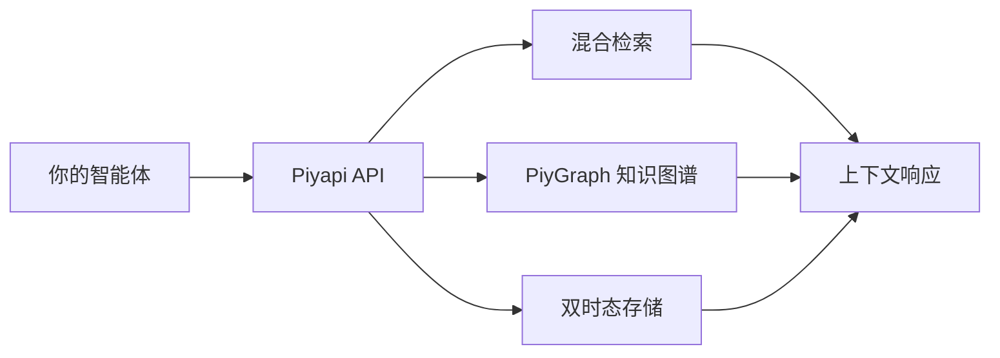

<p align="center">
  
</p>

<div align="center">
<details><summary><b>阅读其他语言版本</b></summary>

🇺🇸 <a href="README.md">English</a> | 🇨🇳 <a href="README.zh-CN.md">简体中文</a>

</details>
</div>

<p align="center">
  <a href="https://piyapi.cloud"></a>
  <a href="docs/HIPAA_ARCHITECTURE.md"></a>
  <a href="docs/SOC2_CONTROLS.md"></a>
  <a href="#-testing"></a>
  <a href="#-testing"></a>
  <a href="docs/API.md"></a>
  <a href="packages/mcp-server/"></a>
  <a href="LICENSE"></a>
</p>

<p align="center">
  <b>PiyAPI by Negentro: 专为 AI 代理打造的视觉与认知内存操作系统</b>
</p>

> **"不要只给你的 AI 一个数据库。给它一个大脑。"**

**PiyAPI** 是首个专为 AI 代理设计的**神经符号化、可自我纠错且具备主权的认知内存操作系统**。我们通过集成了**主动推理**、**贝叶斯真相引擎**、**双时态知识图谱 (`PiyGraph`)**、**双系统认知**、**离线睡眠巩固**、**6 种策略的 PRM 评分**以及**兼容 20+ 司法管辖区 PHI 合规**的认知引擎，取代了碎片化的向量技术栈。

- **主动推理 (Friston FEP)。** 在内存写入时计算变分惊讶得分。高新奇度的事实会触发图谱重新巩固，而冗余文本则被压缩。
- **贝叶斯真相引擎。** 使用 Beta-Binomial 信念分布更新机制，通过 `invalid_at` 时间戳无损取代过时的事实。
- **双时态 PiyGraph。** 支持时间旅行查询的双时钟时态追踪。

<p align="center">
  
</p>

**快速开始** (TypeScript SDK):

```bash
npm install @piyapi/sdk
```

```typescript
import { PiyAPIClient } from '@piyapi/sdk';
const client = new PiyAPIClient({ apiKey: process.env.PIYAPI_API_KEY! });
// ...
```

**支持通过 MCP 集成于** Claude Desktop, Cursor, Antigravity 和 Windsurf。

---

## 🚀 为什么选择 PiyAPI?

传统的向量数据库是静态的黑盒：它们存储嵌入向量，但无法解决事实冲突、理解时态变化，或是保护敏感的医疗/金融数据。

```mermaid
flowchart TB
    subgraph ClientLayer["1. 客户端与代理生态系统"]
        Agents["AI 代理 (Claude, Cursor, AutoGen, CrewAI)"]
        TSSDK["TypeScript SDK (@piyapi/sdk)"]
        PySDK["Python SDK (piyapi-memory)"]
        MCP["模型上下文协议 (40+ 工具)"]
        CDC["12+ 变更数据捕获 (CDC) 连接器"]
    end
    subgraph SecurityGateway["2. 网关与主权安全"]
        GW["API 网关与动态速率限制"]
        PHI["PHI/PII 防火墙 (20+ 司法管辖区)"]
        Shredder["加密数字粉碎器 (密钥销毁)"]
        Audit["不可变审计日志 (HMAC SHA-256 -> S3)"]
    end
    subgraph CognitiveCore["3. 神经符号认知引擎"]
        FEP["主动推理 (Friston FEP 惊讶评分)"]
        TruthEngine["贝叶斯真相引擎 (Beta-Binomial 更新)"]
        PiyGraph["PiyGraph: 双时态知识图谱"]
        DualLane["双系统认知 (系统 1 & 系统 2)"]
        Sleep["6 阶段离线睡眠巩固"]
        HybridScorer["HybridScorer PRM 底层 (6 种策略)"]
    end
    subgraph MemoryHierarchy["4. 四层内存基质"]
        WM["工作记忆 (易失性缓冲区)"]
        EM["情景记忆 (事件流)"]
        SM["语义记忆 (提炼图谱)"]
        PM["程序记忆 (配方与避坑指南)"]
    end
    subgraph DataStorage["5. 加密持久化"]
        PG[("PostgreSQL 15 + pgvector (AES-256-GCM)")]
        Redis[("Redis 7 L1/L2 缓存 + BullMQ")]
    end
    ClientLayer --> SecurityGateway
    SecurityGateway --> CognitiveCore
    CognitiveCore --> MemoryHierarchy
    MemoryHierarchy --> DataStorage
```



## 架构图



---

## 核心功能

| 功能 | 优势与详情 |
|---|---|
| **主动推理引擎** | 在摄取层计算变分惊讶/新奇度指标，消除上下文冗余并减少 token 浪费。 |
| **贝叶斯真相引擎** | 无损的信念更新机制，防止事实演变时发生灾难性的覆盖。 |
| **双时态知识图谱** | 分离“事件时间”与“事务时间”，实现双时钟计时与时间旅行。 |
| **双系统认知** | 快速的系统 1 (低于 15 毫秒缓存) 结合缓慢的系统 2 (推理阅读器 + 推测性预取)。 |
| **6 阶段睡眠巩固** | 模拟哺乳动物的 REM/NREM 睡眠周期，通过自治的离线后台守护进程运行。 |
| **HybridScorer PRM 底层** | 结合密集向量、BM25、SPLADE、指数衰减和图中心性的 6 策略检索引擎。 |
| **主权图谱遗忘引擎** | 通过循环安全的图谱级联和加密密钥销毁机制，实现符合 GDPR 第 17 条的加密粉碎器。 |
| **CDC 自动同步网络** | 支持增量 token 追踪的 12+ 原生变更数据捕获连接器 (GDrive、Notion、GitHub、Slack 等)。 |
| **多管辖区 PHI 防火墙** | 38 模块的零信任安全边界，确保底层 LLM 无任何原始 PII 泄漏。 |

---

## 基准测试与引擎指标验证 (审计时间：2026年8月)

| 指标 | 实时生产数据 |
|---|---|
| **生产基础代码** | **426,524+ 行代码** 分布在 **1,239** 个 TypeScript 模块中 |
| **测试套件** | **9,258** 个测试用例，覆盖 **673** 个测试文件 (100% Jest) |
| **基于属性的测试** | **1,329** 个 `fc.property()` 数学正确性断言 |
| **HTTP 路由端点** | **16** 个对外 API 端点 (内部共 516 个) |
| **MCP 工具** | **40 个核心工具 / 52 个注册项** (`@piyapi/mcp-server` v2.0.0) |
| **数据库迁移** | **298** 个 SQL 迁移文件，包含 **90** 个 RLS 安全策略 |
| **CDC 数据连接器** | **12** 个内置提供商 |
| **认知子系统** | **51** 个专用服务模块 |
| **困难基准测试通过率** | **93.8%** (75/80) |
| **对抗性安全测试通过率** | **82.6%** (71/86) |

---

## 安装与快速开始

<details>
<summary><b>1. 模型上下文协议 (MCP) 服务器</b></summary>

将其添加到您的 `claude_desktop_config.json` 或 `mcp_config.json`:

```json
{
  "mcpServers": {
    "piyapi": {
      "command": "npx",
      "args": ["-y", "@piyapi/mcp-server"],
      "env": {
        "PIYAPI_API_KEY": "your_piyapi_api_key_here",
        "PIYAPI_BASE_URL": "https://api.piyapi.cloud"
      }
    }
  }
}
```
</details>

<details>
<summary><b>2. TypeScript SDK</b></summary>

```bash
npm install @piyapi/sdk
```

```typescript
import { PiyAPIClient } from '@piyapi/sdk';

const client = new PiyAPIClient({
  apiKey: process.env.PIYAPI_API_KEY!,
  baseUrl: 'https://api.piyapi.cloud',
});

// 1. 摄取事实知识，具有自动 PHI 脱敏和图谱链接功能
const memory = await client.memory.create({
  content: '患者被开具了每日两次 500mg 二甲双胍用于治疗 2 型糖尿病。',
  metadata: { domain: 'medical', patientId: 'pat_demo_001' },
});

// 2. 面向 LLM 的 Token 感知智能上下文检索
const context = await client.context.retrieve({
  query: '患者正在服用什么药物？',
  maxTokens: 1500,
});

console.log('用于 LLM 提示词的优化上下文:', context.text);
```
</details>

<details>
<summary><b>3. Python SDK</b></summary>

```bash
pip install piyapi-memory
```

```python
from piyapi import PiyAPIClient

client = PiyAPIClient(api_key="your_api_key_here")

# 1. 摄取事实知识
client.memory.store(
    content="生产数据库于 2026 年 8 月 10 日迁移至 AWS us-east-1。",
    metadata={"team": "devops", "environment": "production"}
)

# 2. 双时态时间旅行查询
historical_facts = client.graph.time_travel(
    query="生产数据库托管在哪里？",
    as_of_date="2026-05-01T00:00:00Z"
)
```
</details>

<details>
<summary><b>4. LangChain & LlamaIndex 开箱即用适配器</b></summary>

```python
from langchain.chains import ConversationChain
from langchain_openai import ChatOpenAI
from piyapi_langchain import PiyAPIChatMessageHistory

# 将智能体对话直接连接到 PiyAPI 的持久内存
history = PiyAPIChatMessageHistory(
    session_id="user_session_492",
    api_key="your_api_key"
)

conversation = ConversationChain(
    llm=ChatOpenAI(model="gpt-4o"),
    memory=history
)

response = conversation.predict(input="我们上周二的路线图决定是什么？")
```
</details>

---

## 分类 MCP 工具目录

| 类别 | 工具 | 描述 |
| :--- | :--- | :--- |
| **内存生命周期** | `store_memory`, `update_memory`, `get_memory`, `delete_memory`, `list_memories`, `batch_create`, `pin_memory` | 完整的增删改查及批量摄取，具备自动嵌入和图谱提取功能。 |
| **搜索与检索** | `search_memories`, `fuzzy_search`, `get_context`, `create_context_session`, `ask_memory` | 混合检索、三元组容错以及面向 LLM 提示词的 Token 感知上下文打包。 |
| **知识图谱** | `get_graph`, `graph_traverse`, `create_relationship`, `delete_relationship`, `get_clusters`, `kg_search`, `kg_entities`, `kg_ingest`, `kg_stats` | 交互式关系图谱、多跳遍历、实体查找和集群提取。 |
| **时间与时态旅行** | `kg_time_travel`, `version_history`, `rollback_memory` | 重建过去任何历史时间点的内存状态；检查差异并回滚。 |
| **认知与质量** | `session_mine`, `session_propose`, `deduplicate`, `find_contradictions`, `memory_audit`, `feedback_positive`, `feedback_negative` | 从对话记录中提取候选记忆、解决事实冲突并训练自适应衰减机制。 |
| **数据连接器** | `list_connectors`, `trigger_connector_sync`, `clip_web_page`, `get_connector_logs` | 手动触发 Google Drive/Notion/GitHub 的 CDC 同步并将网页文章剪藏至内存。 |
| **安全与隐私** | `check_phi`, `export_all` | 验证文本中是否存在受保护的健康信息 (PHI)，并生成 GDPR 导出数据包。 |

---

## 🧪 测试与验证

```bash
npm test           # 运行 Jest 下的所有 9,258 个测试用例
npm run test:props # 运行 1,329 个基于属性的测试 (fast-check)
npm run test:chaos # 运行混乱及弹性测试套件
```

---

## 知识产权、安全与发布安全协议

### 法律与合规免责声明
> ⚠️ **合规免责声明:** PiyAPI 提供技术控制措施 (例如 PHI/PII 脱敏、字段级加密、审计日志)，旨在协助满足合规要求。若要全面遵守 HIPAA、GDPR 或 SOC 2 等法规，必须进行适当的基础设施配置、组织治理，并在适用的情况下签署业务伙伴协议 (BAA)。

---

## 🤝 社区与支持

<p align="center">
  <a href="https://www.linkedin.com/company/negentroai/"></a>
  <a href="https://www.reddit.com/r/negentro/"></a>
  <a href="https://www.instagram.com/negentroai/"></a>
</p>

- 🏢 **企业合作与 BAA:** `care.piyapi@outlook.com`
- 🔒 **安全披露:** `piyapi.cloud@gmail.com`

<p align="center">
<strong>PiyAPI by Negentro — 赋予 AI 代理真正持久的心智。</strong>
</p>
