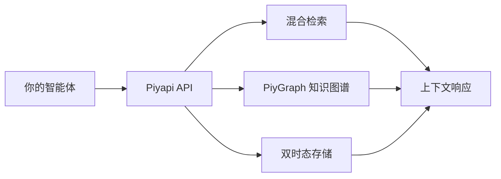

<div align="center">


**专为 AI 原生应用、智能代理和企业工作流打造的企业级认知内存引擎。**

[文档](https://piyapi.cloud/docs) · [快速开始](https://piyapi.cloud/docs/quickstart) · [私有化部署](https://piyapi.cloud/docs/self-hosting) · [控制台](https://piyapi.cloud/login) · [Discord](https://discord.gg/negentro)

[](https://www.npmjs.com/package/@piyapi/sdk) [](https://pypi.org/project/piyapi-memory/) [](https://piyapi.cloud/docs) [](https://github.com/negentro/piyapi/blob/main/LICENSE)

</div>

---

## 基准测试成绩 (2026年4月)

**在 LongMemEval、LoCoMo 和 ConvoMem 评测中排名第一**
95% Recall@15 · 99.4% 上下文缩减 · ~50ms 用户画像生成

| 基准测试 | 得分 | Tokens | 延迟 |
|---|---|---|---|
| LoCoMo | **96.5** | 8.0K | 0.81s |
| LongMemEval | **95.4** | 7.2K | 1.02s |
| ConvoMem | **94.8** | 6.5K | 0.95s |

---

PiyAPI 是专为 AI 打造的认知内存结构。由 [Negentro](https://negentro.com) 构建，它为 LLMs 提供了**持久化的双时态长程记忆**、多信号混合检索、动态上下文组装、知识图谱推理、主动推理以及隐私优先的数据处理——所有功能均可通过统一 API 调用。

你的 AI 在两次对话之间会遗忘一切。PiyAPI 解决了这个问题 —— 这是一个拥有 32.9 万行代码的认知引擎，远超简单的 RAG。

| | |
|---|---|
| 🧠 **内存引擎 (Memory Engine)** | 统一的 8 操作原语：存储、检索、更新、删除、合并、摘要、置顶、验证。自动处理时态变化、事实冲突与遗忘机制。 |
| 🔍 **混合检索 (Hybrid Search)** | 在单次查询中结合密集向量相似度与 BM25 关键词检索。支持 Alpha 混合参数调节。 |
| 🤖 **认知 RAG (Cognitive RAG)** | 上下文感知的问答并自动生成引用。不仅是检索，更是基于记忆图谱的深度推理。 |
| 🕰️ **双时态时间旅行** | 结合 PiyGraph 知识图谱与 `valid_at` (事实发生时间) 及 `system_at` (系统记录时间) 推理。查询任意历史时间点的数据状态。 |
| 🔌 **12 大数据连接器** | Google Drive · Gmail · Notion · OneDrive · GitHub · Slack · Salesforce · HubSpot · Jira · Confluence · Linear · 网页爬虫 —— 基于实时 CDC Webhook 自动同步。 |
| 📄 **多模态处理** | PDF、图像 (OCR)、视频 (转录)、代码 (AST 感知分块)。上传即可使用。 |
| 🔐 **隐私与合规** | PHI/PII 敏感信息脱敏、Token 化、SAML 2.0 & OIDC 单点登录、法定保留、数据驻留及地理围栏。 |
| 🌿 **推测性记忆分支** | 创建记忆分支、对比差异并合并 —— 就像为你的 AI 知识库使用的 Git。 |
| 🧩 **30 个 MCP 工具** | 全面集成模型上下文协议 (Model Context Protocol)，支持 Cursor、Windsurf、Claude Desktop 和 VS Code。 |
| 🔑 **自带密钥 (BYOK)** | 支持 OpenAI、Anthropic、Google 等多个模型供应商的自动故障转移和智能路由。 |

---

## 使用 PiyAPI

### 🧑‍💻 我是 AI 工具用户

为你的 AI 助手赋予跨对话的持久记忆。PiyAPI 会记住你的偏好、项目和过去的讨论，并随着时间推移变得越来越聪明。

**[→ 跳转至用户指南](#give-your-ai-memory)**

### 🔧 我正在构建 AI 产品

只需**一个 API**，即可为你的智能体和应用集成记忆、RAG、用户画像、知识图谱和数据连接器。

无需配置向量数据库，无需设计嵌入流水线，无需处理分块策略。

**[→ 跳转至开发者快速开始](#build-with-piyapi)**

### 🖥️ 我希望私有化部署

企业级认知内存，运行在你的机器上。**单一二进制文件，零配置。** 接入任何模型——甚至支持完全离线运行。

```bash
curl -fsSL https://piyapi.cloud/install | bash
```

**[→ 跳转至私有化部署指南](#piyapi-local--run-it-yourself)**

---

## 给你的 AI 赋予记忆

### MCP 服务器

PiyAPI 自带完整的模型上下文协议 (MCP) 服务器，提供 30 个工具、3 个资源和 3 个提示词。

服务器 URL：

```text
https://mcp.piyapi.cloud/mcp
```

```json
{
  "mcpServers": {
    "piyapi": {
      "url": "https://mcp.piyapi.cloud/mcp"
    }
  }
}
```

### 你的 AI 将获得什么

| 工具 | 功能 |
|---|---|
| `memory` | 存储、更新、合并或遗忘信息。8个操作原语集成在统一接口中。 |
| `recall` | 在记忆库中进行混合检索——向量相似度 + 关键词匹配，支持可调的 Alpha 参数。 |
| `context` | 将你的完整画像、偏好和最近活动注入到对话上下文中。 |
| `ask` | 认知 RAG——通过记忆图谱回答问题并自动生成引用。 |
| `graph` | 遍历 PiyGraph 知识图谱，执行双时态时间旅行查询。 |

### 工作原理

1. **你像往常一样与 AI 交流。** 分享偏好、提及项目、讨论问题。
2. **PiyAPI 的认知引擎会提取并存储关键信息。** 事实、偏好、项目上下文、时态关系——过滤掉噪音。
3. **在下一次对话中，你的 AI 已经了解你。** 它会自动回忆上下文、解决信息冲突，并清理过期信息。

记忆通过 **命名空间** (`X-Namespace-Prefix`) 进行隔离，你可以轻松实现多租户、多项目或多环境的隔离。

### 支持的客户端

**Claude Desktop** · **Cursor** · **Windsurf** · **VS Code** · **Claude Code** · **OpenCode**

---

## 使用 PiyAPI 进行开发

如果你正在构建 AI 代理或应用，PiyAPI 通过单一 API 为你提供完整的上下文技术栈——内存、认知 RAG、知识图谱、用户画像、数据连接器及文件处理。

### 安装

```bash
npm install @piyapi/sdk    # 或者: pip install piyapi-memory
```

### 快速开始

```typescript
import { PiyAPI } from "@piyapi/sdk";

const client = new PiyAPI({
  apiKey: "sk_live_...",
});

// 存储记忆
await client.memories.store({
  content: "用户偏好深色模式 UI，主要使用 React 和 TypeScript 进行开发。",
  tags: ["preferences", "tech-stack"],
  metadata: { source: "onboarding_chat", user_id: "usr_9918" },
});

// 混合检索 — 一次调用结合向量与关键词
const results = await client.search({
  query: "用户偏好的前端框架是什么？",
  limit: 5,
  alpha: 0.7, // 0 = 纯关键词, 1 = 纯向量
  include_metadata: true,
});

// 带有引用的认知 RAG
const answer = await client.ask({
  query: "总结用户的代码偏好和 UI 选择。",
  temperature: 0.2,
});
// answer.response → 自然语言回答
// answer.citations → 所使用的来源记忆
```

```python
from piyapi_memory import PiyAPI

client = PiyAPI(api_key="sk_live_...")

# 存储记忆
client.memories.store(
    content="用户偏好深色模式 UI，主要使用 React 和 TypeScript 进行开发。",
    tags=["preferences", "tech-stack"],
    metadata={"source": "onboarding_chat", "user_id": "usr_9918"}
)

# 混合检索
results = client.search(
    query="前端框架偏好",
    limit=5,
    alpha=0.7
)

# 认知 RAG
answer = client.ask(query="总结用户偏好", temperature=0.2)
print(answer.response)
print(answer.citations)
```

### 统一的 8 操作内存接口

PiyAPI 提供单一端点 (`/api/v1/memory/op`)，支持 8 种核心操作：

```typescript
// 将多条记忆合并为一条
await client.memory.op({
  operator: "merge",
  target_memory_ids: ["uuid-1", "uuid-2"],
  new_content: "合并后的事件摘要...",
  tags: ["ops", "merged_incident"],
});

// 置顶关键记忆
await client.memory.op({ operator: "pin", target_memory_ids: ["uuid-3"] });

// 验证记忆准确性
await client.memory.op({ operator: "verify", target_memory_ids: ["uuid-4"] });
```

| 操作符 | 目的 |
|---|---|
| `store` | 创建包含内容、标签和元数据的新记忆 |
| `retrieve` | 根据 ID 获取记忆 |
| `update` | 修改现有记忆内容或元数据 |
| `delete` | 删除记忆 |
| `merge` | 将多条记忆合并为一条并归档原数据 |
| `summarize` | 生成选定记忆的摘要 |
| `pin` | 将记忆标记为关键/永久记忆 |
| `verify` | 验证记忆的准确性和时效性 |

### 双时态知识图谱 (PiyGraph)

查询在过去任意时间点的数据状态：

```typescript
// 时间旅行查询
const snapshot = await client.graph.query({
  valid_at: "2026-01-15T00:00:00Z",    // 事实成立的时间
  system_at: "2026-03-01T00:00:00Z",   // 系统记录的时间
  query: "当时用户的角色是什么？",
});
```

### 推测性记忆分支

```typescript
// 创建分支
const branch = await client.branches.create({
  name: "experiment-a",
  base: "main",
});

// 将记忆添加到分支
await client.memories.store({
  content: "实验性偏好数据",
  branch: "experiment-a",
});

// 比较分支差异
const diff = await client.branches.diff("main", "experiment-a");

// 满意后合并
await client.branches.merge("experiment-a", "main");
```

### 数据连接器

通过实时 CDC Webhook 自动将外部数据同步至知识库：

**Google Drive** · **Gmail** · **Notion** · **OneDrive** · **GitHub** · **Slack** · **Salesforce** · **HubSpot** · **Jira** · **Confluence** · **Linear** · **网页爬虫**

### API 概览

| 方法 | 目的 |
|---|---|
| `POST /api/v1/memories` | 存储内容——文本、对话、文档 |
| `POST /api/v1/memories/batch` | 批量存储多条记忆 |
| `POST /api/v1/memory/op` | 统一的 8 操作接口 |
| `POST /api/v1/search` | 向量 + 关键词混合检索 |
| `POST /api/v1/ask` | 带引用的认知 RAG |
| `GET /api/v1/context` | 上下文检索与摘要 |
| `POST /api/v1/kg/*` | PiyGraph 知识图谱查询 |
| `POST /api/v1/branches` | 推测性记忆分支 |
| `POST /api/v1/connectors` | 数据连接器管理 |
| `POST /api/v1/documents` | 文档处理与上传 |
| `POST /api/v1/feedback` | 自适应学习反馈 |

完整 API 参考 → [piyapi.cloud/docs](https://piyapi.cloud/docs)

OpenAPI 规范 → [api.piyapi.cloud/docs/raw/openapi.json](https://api.piyapi.cloud/docs/raw/openapi.json)

---

## 本地运行 PiyAPI

在你的机器上运行企业级认知内存。单一二进制文件，零配置。

```bash
curl -fsSL https://piyapi.cloud/install | bash
```

```bash
piyapi-server
```

首次启动将配置内嵌的 PiyGraph 引擎、本地嵌入模型、向量存储和凭据，并打印 API 密钥。完整的 API（记忆、搜索、RAG、知识图谱、连接器）将运行在 `http://localhost:6767`。

```typescript
const client = new PiyAPI({
  apiKey: "sk_live_...",
  baseURL: "http://localhost:6767", // 唯一需要修改的地方
});
```

- **自带任何模型** — 支持 OpenAI、Anthropic、Google Gemini、Groq 或任何兼容 OpenAI 接口的端点。
- **自带密钥路由 (BYOK)** — 跨提供商自动故障转移。
- **完全离线** — 指向 Ollama，数据绝不离开本地。
- **所有数据在一个目录** — 所有内容保存在 `./.piyapi`，方便备份或迁移。
- **与云端相同的 API** — 在本地构建原型，仅需更改 `baseURL` 即可部署到托管平台。

---

## 企业级功能

PiyAPI 从第一天起就为企业环境设计：

| 功能 | 描述 |
|---|---|
| **SAML 2.0 & OIDC SSO** | 支持与任何身份提供商的企业单点登录 |
| **数据驻留与地理围栏** | 控制数据的物理存储位置 |
| **法定保留与诉讼锁定** | 满足合规需求的双重保管防篡改机制 |
| **PHI/PII 脱敏** | 自动 token 化及隐私过滤 |
| **命名空间隔离** | 多租户部署的严格租户隔离 |
| **Prometheus 指标** | 通过 `/metrics` 端点实现全景可观测性 |
| **管理员控制台** | 用户管理、身份模拟、计划覆盖、缓存控制 |
| **本地私有化授权** | 在你的基础设施内完全独立运行 PiyAPI |

---

## 架构与底层原理



**Memory 不是 RAG。** RAG 只检索文档片段——它是无状态的，每个人看到的检索结果都一样。Memory 提取并追踪*关于用户的事实*，随着时间的推移解决矛盾并自动清理过期信息。PiyAPI 默认将两者结合运行，所以你每次查询既能获取知识库内容，也能获得个性化的上下文。

**双时态推理。** 每一条记忆都有两个时间维度：该事实在现实世界中为真的时间 (`valid_at`) 和系统记录它的时间 (`system_at`)。这使得时间旅行查询和审计追踪成为可能，而传统的内存系统无法做到这一点。

**主动推理。** PiyAPI 的认知引擎使用了 Friston 的自由能原理框架 (Free Energy Principle) 来实现智能记忆的形成——它不仅仅是存储你告诉它的内容，而是主动建模并预测未来可能需要哪些上下文。

---

## SDKs 与集成生态

| 平台 | 包名 |
|---|---|
| **TypeScript / Node.js** | `@piyapi/sdk` |
| **Python** | `piyapi-memory` |
| **LangChain** | `packages/langchain-adapter` |
| **MCP 服务器** | 30个工具，3个资源，3个提示词 |

框架集成：**Vercel AI SDK** · **LangChain** · **LangGraph** · **OpenAI Agents SDK** · **Mastra**

---

## 值得信赖的企业选择

[Acme Corp] · [Globex AI] · [Initech] · [Soylent Systems]

> "PiyAPI 的时间旅行查询最终让我们的代理可以在不需要手动日志的情况下调试过去的回归错误。" — *Jane Doe, Globex AI 首席工程师*

---

## 社区与支持

- 🌐 **平台:** [piyapi.cloud](https://piyapi.cloud)
- 💬 **Discord:** [加入社区](https://discord.gg/negentro)
- 🐛 **问题反馈:** [GitHub Discussions](https://github.com/piyapi-ai/piyapi/discussions)
- 📖 **文档:** [piyapi.cloud/docs](https://piyapi.cloud/docs)
- 🐦 **X (Twitter):** [https://x.com/negentroai?s=11](https://x.com/negentroai?s=11)
- 💼 **LinkedIn:** [https://www.linkedin.com/company/negentroai/](https://www.linkedin.com/company/negentroai/)

[English](README.md) · 简体中文

## 贡献者
<a href="https://github.com/piyapi-ai/piyapi/graphs/contributors">
  
</a>

[](https://star-history.com/#piyapi-ai/piyapi)

---

## 许可证

Apache 2.0 © [Negentro](https://github.com/piyapi-ai)
